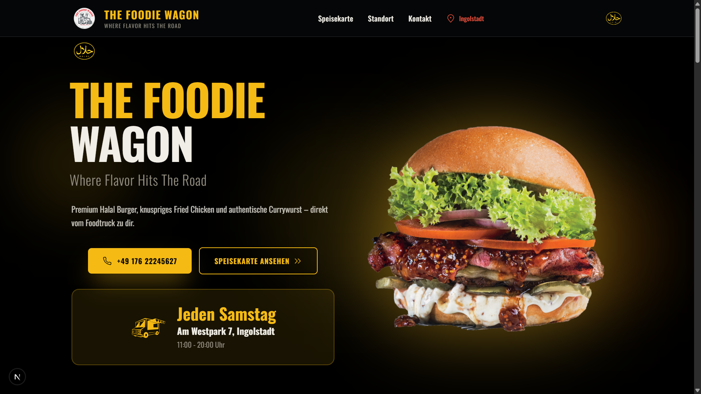
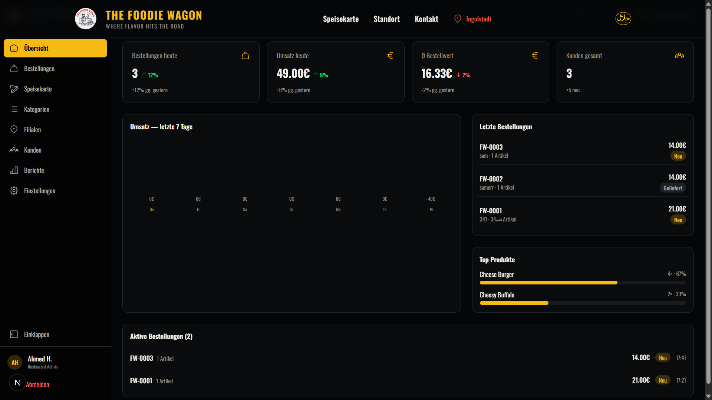

# The Foodie Wagon

**Modern Restaurant Platform** — Customer-facing storefront + Restaurant Admin Dashboard + Super Admin Panel

Built with **Next.js 16**, **React 19**, **TypeScript**, **Tailwind CSS 4**, **Zustand 5**, and **Supabase**.

---

## Preview

### Customer Storefront


### Admin Dashboard


---

## Features

### Customer Storefront
- Full menu with categories (Beef, Chicken, Veggie, Appetizers, Fried Chicken, Dips, Drinks)
- Search & filter (Halal, Vegetarisch, Scharf)
- Shopping cart with size selection (S/M/L)
- Checkout flow: Order type > Customer info > Summary > Confirmation
- Branch selection with delivery/pickup
- Fully responsive mobile-first design

### Restaurant Admin Dashboard (`/dashboard`)
- **Overview** — KPI cards, revenue chart, recent orders, top products
- **Orders Management** — Real-time order tracking, status updates (Neu > In Bearbeitung > Bereit > Geliefert)
- **Menu Management** — Add, edit, delete products with image upload (Cloudinary), sizes, tags
- **Categories** — Manage categories, toggle visibility
- **Branches** — Manage locations, toggle active/inactive, opening hours
- **Customers** — Customer list with order history
- **Reports** — Revenue charts, hourly heatmap, top products, order types (pure CSS/SVG charts)
- **Settings** — Restaurant info, opening hours, delivery, payments, notifications

### Super Admin Panel (`/admin`)
- **Restaurants** — Manage all restaurants, activate/deactivate
- **Subscriptions** — Plans (Starter/Pro/Business), payment tracking
- **Platform Analytics** — Total restaurants, orders, revenue, growth charts

### Backend & Realtime
- **Supabase** — PostgreSQL database, authentication, realtime sync
- **Realtime orders** — New orders appear instantly in the dashboard
- **BroadcastChannel fallback** — Cross-tab sync even without Realtime
- **Polling fallback** — Dashboard polls every 10 seconds for reliability
- **Cloudinary** — Image uploads directly from the dashboard
- **RLS** — Row Level Security for data isolation

---

## Getting Started

### Prerequisites
- **Node.js** 18+
- **pnpm** (recommended)
- **Supabase** account (free tier works)
- **Cloudinary** account (optional, for image uploads)

### Installation

```bash
git clone https://github.com/scxg1/System-for-Restaurants.git
cd System-for-Restaurants
pnpm install
```

Copy `.env.local.example` to `.env.local` and fill in your Supabase and Cloudinary credentials:

```bash
cp .env.local.example .env.local
```

See [SETUP.md](SETUP.md) for the complete step-by-step guide.

```bash
pnpm dev
```

Open [http://localhost:3000](http://localhost:3000).

### Test Credentials

| Role | Email | Password | Dashboard |
|------|-------|----------|-----------|
| Restaurant Admin | `admin@foodiewagon.de` | `admin123` | `/dashboard` |
| Super Admin | `owner@platform.com` | `owner123` | `/admin` |

> Note: Create these users in Supabase Auth first. See [SETUP.md](SETUP.md).

---

## Tech Stack

| Technology | Version | Purpose |
|------------|---------|---------|
| [Next.js](https://nextjs.org/) | 16 | React framework (App Router + Turbopack) |
| [React](https://react.dev/) | 19 | UI library |
| [TypeScript](https://www.typescriptlang.org/) | 5 | Type safety |
| [Tailwind CSS](https://tailwindcss.com/) | 4 | Utility-first styling |
| [Zustand](https://zustand.docs.pmnd.rs/) | 5 | State management with persistence |
| [Supabase](https://supabase.com/) | 2 | Database, Auth, Realtime |
| [Cloudinary](https://cloudinary.com/) | - | Image uploads |
| [iconoir-react](https://iconoir.com/) | - | Icons |
| [Vercel Analytics](https://vercel.com/analytics) | - | Web analytics |

### Fonts
- **Oswald** — Headings
- **Playfair Display** — Secondary text

---

## Project Structure

```
app/
  page.tsx                       # Homepage
  speisekarte/page.tsx           # Full menu page
  login/page.tsx                 # Login page
  dashboard/                     # Restaurant admin
    layout.tsx                   # Dashboard shell (sidebar + topbar + auth guard)
    overview/                    # KPI stats & charts
    orders/                      # Order management
    menu/                        # Product management (CRUD + image upload)
    categories/                  # Category management
    branches/                    # Branch management
    customers/                   # Customer list
    reports/                     # Revenue reports
    settings/                    # Restaurant settings
  admin/                         # Super admin
    restaurants/                 # Restaurant management
    subscriptions/               # Subscription billing
    analytics/                   # Platform analytics

components/
  header.tsx                     # Navigation bar
  hero.tsx                       # Hero section
  menu-section.tsx               # Homepage menu display
  product-card.tsx               # Interactive product card
  cart-drawer.tsx                 # Sliding cart drawer
  checkout-modal.tsx             # 4-step checkout flow
  storefront-shell.tsx           # Conditional layout wrapper
  supabase-sync-provider.tsx     # Realtime sync provider
  dashboard/                     # Dashboard components
    sidebar.tsx                  # Collapsible navigation
    topbar.tsx                   # Top bar + notifications
    stats-card.tsx               # KPI metric card
    order-status-badge.tsx       # Order status indicator
    product-table.tsx            # Products management table
    revenue-chart.tsx            # Pure CSS/SVG chart
    recent-orders-widget.tsx     # Recent orders list
    top-products-widget.tsx      # Top selling products
    notification-bell.tsx        # Realtime notification bell
    image-uploader.tsx           # Cloudinary image upload

lib/
  store/
    cart.ts                      # Cart state (Zustand)
    dashboard.ts                 # Dashboard state (Zustand + persist + Supabase sync)
  supabase/
    client.ts                    # Supabase client singleton
    queries.ts                   # Database queries (CRUD)
    realtime.ts                  # Realtime subscriptions
    mappers.ts                   # Row <-> Model mapping
    types.ts                     # Database type definitions
  hooks/
    use-realtime-sync.ts         # Cross-tab sync + notifications
  i18n/
    translations.ts              # Dashboard translations (DE/AR)
    storefront.ts                # Storefront translations (DE/AR)
  data/
    menu.ts                      # Menu data (35+ products)
  config/
    branches.ts                  # Branch data
  upload/
    cloudinary.ts                # Cloudinary upload utility
  utils/
    sanitize.ts                  # JSON sanitization for scripts

supabase/
  schema.sql                     # Full database schema + seed data

public/                          # Static assets
  burgers/                       # Product images
  Appetizers/                    # Appetizer images
  Fried-Chicken/                 # Fried chicken images
  graphics/                      # Icons & logos
```

---

## Data Flow

```
Customer browses menu (from Supabase)
  -> Add to cart (cart.ts)
  -> Checkout (checkout-modal.tsx)
  -> Order inserted to Supabase
  -> Dashboard receives order via Realtime + Polling
  -> Admin updates status
  -> Statistics auto-update
```

```
Admin manages products in /dashboard/menu
  -> Product saved to Supabase
  -> Storefront & Homepage update in real-time
  -> Image uploaded to Cloudinary
```

---

## Design System

- **Dark/Light theme** with CSS variables
- **Primary accent:** Gold/Yellow (`var(--primary)`)
- **Icons:** iconoir-react
- **Charts:** Pure CSS/SVG — no charting libraries
- **Responsive:** Mobile-first design

### Order Status Colors

| Status | Color | German |
|--------|-------|--------|
| New | Yellow | Neu |
| Preparing | Blue | In Bearbeitung |
| Ready | Green | Bereit |
| Delivered | Gray | Geliefert |
| Cancelled | Red | Storniert |

---

## Deployment

### Vercel (Recommended)

1. Push to GitHub
2. Import project on [Vercel](https://vercel.com)
3. Add environment variables (see [SETUP.md](SETUP.md))
4. Deploy

See [SETUP.md](SETUP.md) for detailed deployment instructions.

---

## License

This project is licensed under the MIT License — see the [LICENSE](LICENSE) file for details.

---

## Contributing

Contributions are welcome! Please read [CONTRIBUTING.md](CONTRIBUTING.md) for details.

---

Built by **The Foodie Wagon Team**
